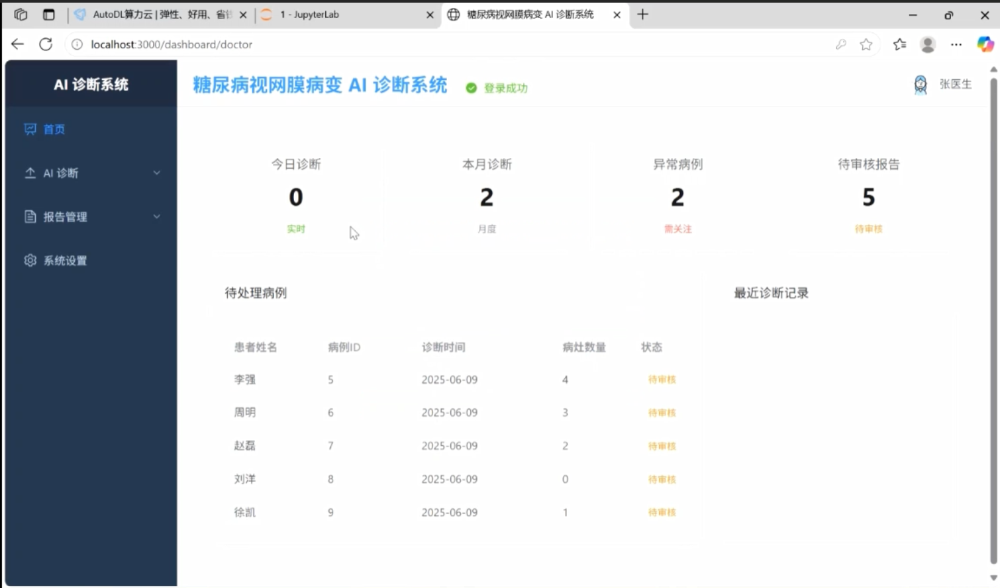
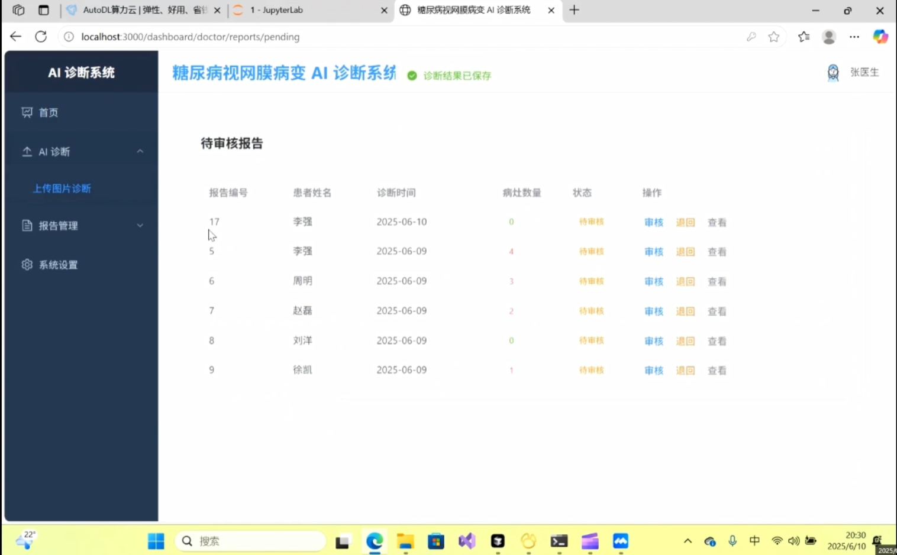
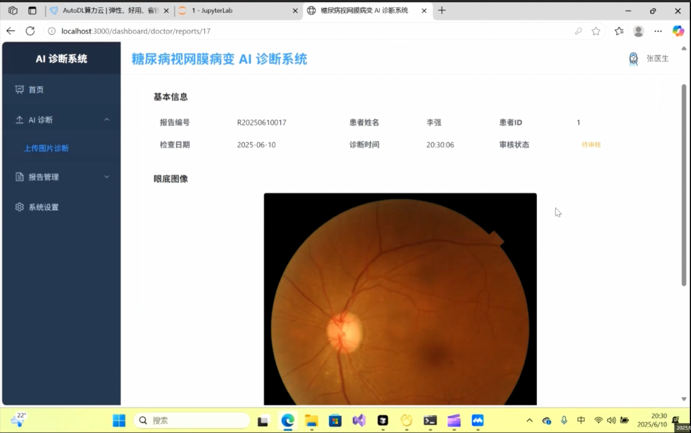
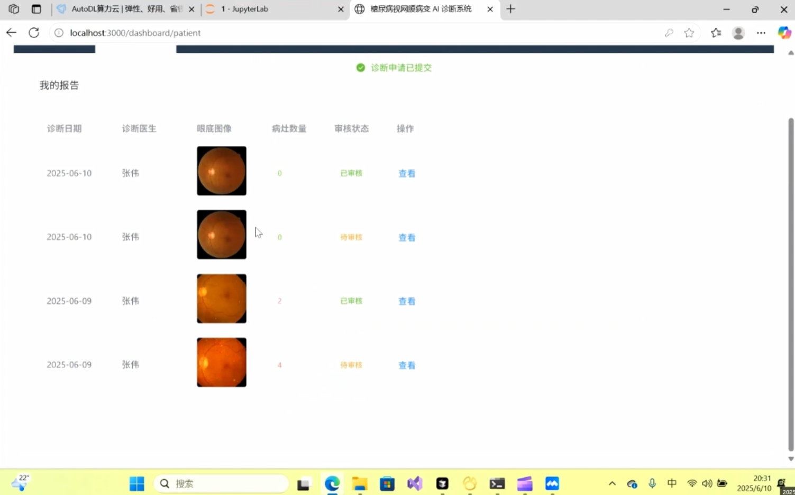
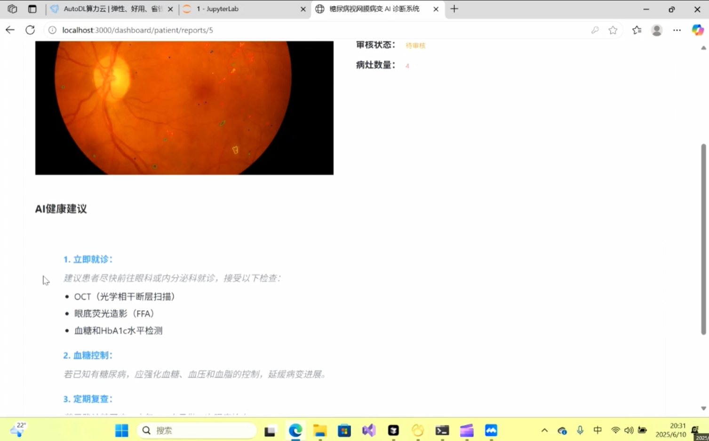

# Diagnosis-of-diabetes-retinopathy
## AI-Assisted Diabetic Retinopathy Diagnosis System

An end-to-end web-based diabetic retinopathy diagnosis system integrating deep learning segmentation models with a Flask backend and Vue3 frontend.
(All programming files are in https://github.com/WBNvs/Diagnosis-of-diabetes-retinopathy/tree/main/%E7%8E%8B%E8%B4%9D%E5%AE%81)

> Developed as a software engineering and AI course research project at Tongji University.

---

## Overview

This project provides an AI-assisted diagnosis platform for diabetic retinopathy (DR). It combines state-of-the-art retinal lesion segmentation models with a complete web application, allowing users to upload retinal images and receive automated diagnostic results.

Unlike a standalone deep learning implementation, this project integrates:

- Deep learning model inference
- Flask backend services
- Vue3 frontend
- RESTful APIs
- MySQL database
- Full-stack deployment

---

## Features

- Upload retinal fundus images
- Automatic lesion segmentation
- AI-assisted diabetic retinopathy diagnosis
- User-friendly web interface
- Database management
- RESTful API communication
- Backend–frontend integration

---

## Tech Stack

### Backend

- Python
- Flask
- PyTorch
- MySQL

### Frontend

- Vue3
- JavaScript
- Vite

### AI

- PyTorch
- MMSegmentation
- Transformer-based feature interaction
- Medical image segmentation

---

## Contributions

- Developed Flask backend services
- Designed RESTful APIs
- Built frontend using Vue3
- Integrated deep learning models into a deployable system
- Implemented backend–database communication
- Improved segmentation performance by incorporating Transformer-based feature interaction modules
- Conducted model training and evaluation
- Coordinated system integration as project leader

---

## Experimental Results

The improved segmentation model was evaluated on public retinal datasets, including:

- IDRiD
- FGADR
- DDR
- TJDR

Performance improvements were achieved compared with the baseline implementation.

*(More experimental details can be found in the project report.)*

---

## Acknowledgements

This project incorporates and extends the following open-source works:

- HACDR-Net
- M2MRF-Lesion-Segmentation

The original repositories belong to their respective authors.

Our work focuses on model improvement, system integration, deployment, and AI-assisted diagnosis.

---

## Screenshots

### Doctor's Dashboard

### Doctor's Patient List Page

### Doctor's Diagnosis Page

### Patient's Dashboard

### Patient's Segmentation Result

