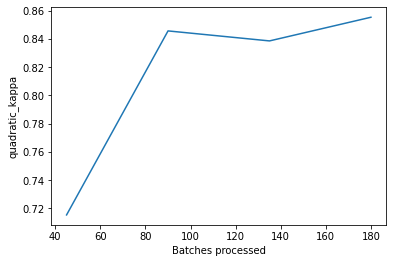

# APTOS_DDR_EDAnStarter

**Preparation**


```python
%reload_ext autoreload
%autoreload 2
%matplotlib inline
```


```python
from fastai import *
from fastai.vision import *
import pandas as pd
import matplotlib.pyplot as plt
import os
import warnings
warnings.filterwarnings('ignore', category=UserWarning)
```


```python
# Making pretrained weights work without needing to find the default filename
# Maybe not needed anymore?
# if not os.path.exists('/.cache/torch/hub/checkpoints/'):
#         os.makedirs('/.cache/torch/hub/checkpoints/')
# !cp '/resnet50.pth' '/.cache/torch/hub/checkpoints/resnet50-0676ba61.pth'
```


```python
print('Make sure cudnn is enabled:', torch.backends.cudnn.enabled)
```

    Make sure cudnn is enabled: True


```python
def seed_everything(seed):
    random.seed(seed)
    os.environ['PYTHONHASHSEED'] = str(seed)
    np.random.seed(seed)
    torch.manual_seed(seed)
    torch.cuda.manual_seed(seed)
    torch.backends.cudnn.deterministic = True

SEED = 999
seed_everything(SEED)
```

**Reading data and Basic EDA**
Open the dataset with pandas, check distribution of labels.


```python
base_image_dir = 'autodl-tmp/DDR/'
train_dir = os.path.join(base_image_dir,'train_images/')
df = pd.read_csv(os.path.join(base_image_dir, 'train.csv'))
df['path'] = df['id_code'].map(lambda x: os.path.join(train_dir,'{}.png'.format(x)))
df = df.drop(columns=['id_code'])
df = df.sample(frac=1).reset_index(drop=True) # shuffle dataframe
df.head(10)
```


<div>
<style scoped>
    .dataframe tbody tr th:only-of-type {
        vertical-align: middle;
    }

    .dataframe tbody tr th {
        vertical-align: top;
    }

    .dataframe thead th {
        text-align: right;
    }
</style>
<table border="1" class="dataframe">
  <thead>
    <tr style="text-align: right;">
      <th></th>
      <th>diagnosis</th>
      <th>path</th>
    </tr>
  </thead>
  <tbody>
    <tr>
      <th>0</th>
      <td>2</td>
      <td>autodl-tmp/DDR/train_images/a01c590c444f.png</td>
    </tr>
    <tr>
      <th>1</th>
      <td>1</td>
      <td>autodl-tmp/DDR/train_images/22098b1fe461.png</td>
    </tr>
    <tr>
      <th>2</th>
      <td>0</td>
      <td>autodl-tmp/DDR/train_images/83a63c4a3e4a.png</td>
    </tr>
    <tr>
      <th>3</th>
      <td>4</td>
      <td>autodl-tmp/DDR/train_images/e821c1b6417a.png</td>
    </tr>
    <tr>
      <th>4</th>
      <td>0</td>
      <td>autodl-tmp/DDR/train_images/bd06028eb7dd.png</td>
    </tr>
    <tr>
      <th>5</th>
      <td>3</td>
      <td>autodl-tmp/DDR/train_images/6089fa333013.png</td>
    </tr>
    <tr>
      <th>6</th>
      <td>2</td>
      <td>autodl-tmp/DDR/train_images/9b418ce42c13.png</td>
    </tr>
    <tr>
      <th>7</th>
      <td>0</td>
      <td>autodl-tmp/DDR/train_images/c6a8f8f998a2.png</td>
    </tr>
    <tr>
      <th>8</th>
      <td>0</td>
      <td>autodl-tmp/DDR/train_images/b72f59b85f7c.png</td>
    </tr>
    <tr>
      <th>9</th>
      <td>1</td>
      <td>autodl-tmp/DDR/train_images/8bbd7835e9aa.png</td>
    </tr>
  </tbody>
</table>
</div>


```python
len_df = len(df)
print(f"There are {len_df} images")
```

    There are 3662 images


This is actually very **small**.


```python
df['diagnosis'].hist(figsize = (10, 5))
```


    <AxesSubplot:>


    

    


The dataset is highly **imbalanced**, with many samples for level 0, and very little for the rest of the levels.

Let's look at an example image.


```python
from PIL import Image

im = Image.open(df['path'][1])
width, height = im.size
print(width,height) 
im.show()
```

    2896 1944


    

    


```python
plt.imshow(np.asarray(im))
```


    <matplotlib.image.AxesImage at 0x7ff8678a7df0>


    

    


The images are quite big. We will resize to a much smaller size.


```python
bs = 64 # smaller batch size is better for training, but may take longer
sz=224
```


```python
tfms = get_transforms(do_flip=True,flip_vert=True,max_rotate=360,max_warp=0,max_zoom=1.1,max_lighting=0.1,p_lighting=0.5)
src = (ImageList.from_df(df=df,path='./',cols='path') # get dataset from dataset
        .split_by_rand_pct(0.2) # Splitting the dataset
        .label_from_df(cols='diagnosis',label_cls=FloatList) # obtain labels from the level column
      )
data= (src.transform(tfms,size=sz,resize_method=ResizeMethod.SQUISH,padding_mode='zeros') # Data augmentation
        .databunch(bs=bs,num_workers=4) # DataBunch
        .normalize(imagenet_stats) # Normalize     
       )
```


```python
data.show_batch(rows=3, figsize=(7,6))
```


    

    


**Training (Transfer learning)**


```python
from sklearn.metrics import cohen_kappa_score

def quadratic_kappa(y_hat, y):
    # 确保将数据转换为CPU上的NumPy数组以便计算
    y_hat_cpu = y_hat.cpu().numpy() if y_hat.device != torch.device('cpu') else y_hat.numpy()
    y_cpu = y.cpu().numpy() if y.device != torch.device('cpu') else y.numpy()
    
    # 计算Kappa分数并返回，保持原始设备
    kappa_score = cohen_kappa_score(torch.round(torch.tensor(y_hat_cpu)), y_cpu, weights='quadratic')
    
    # 将Kappa分数转换为与输入张量相同设备上的torch.tensor
    return torch.tensor(kappa_score, device=y_hat.device)

# def quadratic_kappa(y_hat, y):
#     return torch.tensor(cohen_kappa_score(torch.round(y_hat), y, weights='quadratic'),device='cuda:0')
```

**Training**
We use *transfer learning*, where we retrain the last layers of a pretrained neural network. We use the *ResNet50* architecture trained on the *ImageNet* dataset, which has been commonly used for pre-training applications in computer vision. *Fastai* makes it quite simple to create a model and train:


```python
learn = cnn_learner(data, base_arch=models.resnet50, metrics = [quadratic_kappa])
```


```python
learn.lr_find()
learn.recorder.plot(suggestion=True)
```


<style>
    /* Turns off some styling */
    progress {
        /* gets rid of default border in Firefox and Opera. */
        border: none;
        /* Needs to be in here for Safari polyfill so background images work as expected. */
        background-size: auto;
    }
    progress:not([value]), progress:not([value])::-webkit-progress-bar {
        background: repeating-linear-gradient(45deg, #7e7e7e, #7e7e7e 10px, #5c5c5c 10px, #5c5c5c 20px);
    }
    .progress-bar-interrupted, .progress-bar-interrupted::-webkit-progress-bar {
        background: #F44336;
    }
</style>


    <div>
      <progress value='1' class='' max='3' style='width:300px; height:20px; vertical-align: middle;'></progress>
      33.33% [1/3 02:14&lt;04:28]
    </div>

<table border="1" class="dataframe">
  <thead>
    <tr style="text-align: left;">
      <th>epoch</th>
      <th>train_loss</th>
      <th>valid_loss</th>
      <th>quadratic_kappa</th>
      <th>time</th>
    </tr>
  </thead>
  <tbody>
    <tr>
      <td>0</td>
      <td>6.301118</td>
      <td>#na#</td>
      <td>02:14</td>
    </tr>
  </tbody>
</table><p>

    <div>
      <progress value='40' class='' max='45' style='width:300px; height:20px; vertical-align: middle;'></progress>
      88.89% [40/45 01:55&lt;00:14 15.6057]
    </div>


    LR Finder is complete, type {learner_name}.recorder.plot() to see the graph.
    Min numerical gradient: 9.12E-07
    Min loss divided by 10: 1.00E-02


    

    


Here we can see that the loss decreases fastest around lr=1e-2 so that is what we will use to train:


```python
learn.fit_one_cycle(4,max_lr = 1e-2)
```


<style>
    /* Turns off some styling */
    progress {
        /* gets rid of default border in Firefox and Opera. */
        border: none;
        /* Needs to be in here for Safari polyfill so background images work as expected. */
        background-size: auto;
    }
    progress:not([value]), progress:not([value])::-webkit-progress-bar {
        background: repeating-linear-gradient(45deg, #7e7e7e, #7e7e7e 10px, #5c5c5c 10px, #5c5c5c 20px);
    }
    .progress-bar-interrupted, .progress-bar-interrupted::-webkit-progress-bar {
        background: #F44336;
    }
</style>


<table border="1" class="dataframe">
  <thead>
    <tr style="text-align: left;">
      <th>epoch</th>
      <th>train_loss</th>
      <th>valid_loss</th>
      <th>quadratic_kappa</th>
      <th>time</th>
    </tr>
  </thead>
  <tbody>
    <tr>
      <td>0</td>
      <td>4.237464</td>
      <td>1.027871</td>
      <td>0.715376</td>
      <td>02:45</td>
    </tr>
    <tr>
      <td>1</td>
      <td>1.931283</td>
      <td>0.404863</td>
      <td>0.845691</td>
      <td>02:41</td>
    </tr>
    <tr>
      <td>2</td>
      <td>1.081722</td>
      <td>0.408914</td>
      <td>0.838607</td>
      <td>02:49</td>
    </tr>
    <tr>
      <td>3</td>
      <td>0.747474</td>
      <td>0.351091</td>
      <td>0.855370</td>
      <td>02:48</td>
    </tr>
  </tbody>
</table>


```python
learn.recorder.plot_losses()
learn.recorder.plot_metrics()
```


    

    


    

    


```python
learn.unfreeze()
learn.lr_find()
learn.recorder.plot(suggestion=True)
```


<style>
    /* Turns off some styling */
    progress {
        /* gets rid of default border in Firefox and Opera. */
        border: none;
        /* Needs to be in here for Safari polyfill so background images work as expected. */
        background-size: auto;
    }
    progress:not([value]), progress:not([value])::-webkit-progress-bar {
        background: repeating-linear-gradient(45deg, #7e7e7e, #7e7e7e 10px, #5c5c5c 10px, #5c5c5c 20px);
    }
    .progress-bar-interrupted, .progress-bar-interrupted::-webkit-progress-bar {
        background: #F44336;
    }
</style>


    <div>
      <progress value='1' class='' max='3' style='width:300px; height:20px; vertical-align: middle;'></progress>
      33.33% [1/3 02:10&lt;04:20]
    </div>

<table border="1" class="dataframe">
  <thead>
    <tr style="text-align: left;">
      <th>epoch</th>
      <th>train_loss</th>
      <th>valid_loss</th>
      <th>quadratic_kappa</th>
      <th>time</th>
    </tr>
  </thead>
  <tbody>
    <tr>
      <td>0</td>
      <td>0.540344</td>
      <td>#na#</td>
      <td>02:10</td>
    </tr>
  </tbody>
</table><p>

    <div>
      <progress value='31' class='' max='45' style='width:300px; height:20px; vertical-align: middle;'></progress>
      68.89% [31/45 01:31&lt;00:41 1.8344]
    </div>


    LR Finder is complete, type {learner_name}.recorder.plot() to see the graph.
    Min numerical gradient: 7.59E-07
    Min loss divided by 10: 5.75E-07


    

    


```python
learn.fit_one_cycle(6, max_lr=slice(1e-6,1e-3))
```


<style>
    /* Turns off some styling */
    progress {
        /* gets rid of default border in Firefox and Opera. */
        border: none;
        /* Needs to be in here for Safari polyfill so background images work as expected. */
        background-size: auto;
    }
    progress:not([value]), progress:not([value])::-webkit-progress-bar {
        background: repeating-linear-gradient(45deg, #7e7e7e, #7e7e7e 10px, #5c5c5c 10px, #5c5c5c 20px);
    }
    .progress-bar-interrupted, .progress-bar-interrupted::-webkit-progress-bar {
        background: #F44336;
    }
</style>


<table border="1" class="dataframe">
  <thead>
    <tr style="text-align: left;">
      <th>epoch</th>
      <th>train_loss</th>
      <th>valid_loss</th>
      <th>quadratic_kappa</th>
      <th>time</th>
    </tr>
  </thead>
  <tbody>
    <tr>
      <td>0</td>
      <td>0.507793</td>
      <td>0.348110</td>
      <td>0.849090</td>
      <td>02:40</td>
    </tr>
    <tr>
      <td>1</td>
      <td>0.494007</td>
      <td>0.311583</td>
      <td>0.863817</td>
      <td>02:46</td>
    </tr>
    <tr>
      <td>2</td>
      <td>0.456657</td>
      <td>0.300452</td>
      <td>0.885282</td>
      <td>02:46</td>
    </tr>
    <tr>
      <td>3</td>
      <td>0.415246</td>
      <td>0.303266</td>
      <td>0.870550</td>
      <td>02:46</td>
    </tr>
    <tr>
      <td>4</td>
      <td>0.393601</td>
      <td>0.283408</td>
      <td>0.879881</td>
      <td>02:41</td>
    </tr>
    <tr>
      <td>5</td>
      <td>0.372737</td>
      <td>0.278605</td>
      <td>0.885501</td>
      <td>02:42</td>
    </tr>
  </tbody>
</table>


```python
learn.recorder.plot_losses()
learn.recorder.plot_metrics()
```


    

    


    

    


```python
learn.export()
learn.save('stage-2')
```

**Evaluate the model**


```python
interp = ClassificationInterpretation.from_learner(learn)

losses,idxs = interp.top_losses()

len(data.valid_ds)==len(losses)==len(idxs)
```


<style>
    /* Turns off some styling */
    progress {
        /* gets rid of default border in Firefox and Opera. */
        border: none;
        /* Needs to be in here for Safari polyfill so background images work as expected. */
        background-size: auto;
    }
    progress:not([value]), progress:not([value])::-webkit-progress-bar {
        background: repeating-linear-gradient(45deg, #7e7e7e, #7e7e7e 10px, #5c5c5c 10px, #5c5c5c 20px);
    }
    .progress-bar-interrupted, .progress-bar-interrupted::-webkit-progress-bar {
        background: #F44336;
    }
</style>


    True


```python
interp.plot_confusion_matrix(figsize=(12,12), dpi=60)
```


    ---------------------------------------------------------------------------

    AttributeError                            Traceback (most recent call last)

    /tmp/ipykernel_18290/3613579820.py in <module>
    ----> 1 interp.plot_confusion_matrix(figsize=(12,12), dpi=60)
    

    ~/miniconda3/lib/python3.8/site-packages/fastai/train.py in plot_confusion_matrix(self, normalize, title, cmap, slice_size, norm_dec, plot_txt, return_fig, **kwargs)
        199         plt.title(title)
        200         tick_marks = np.arange(self.data.c)
    --> 201         plt.xticks(tick_marks, self.data.y.classes, rotation=90)
        202         plt.yticks(tick_marks, self.data.y.classes, rotation=0)
        203 


    AttributeError: 'FloatList' object has no attribute 'classes'


    

    


**Optimize the Metric**


```python
valid_preds = learn.get_preds(ds_type=DatasetType.Valid)
```


<style>
    /* Turns off some styling */
    progress {
        /* gets rid of default border in Firefox and Opera. */
        border: none;
        /* Needs to be in here for Safari polyfill so background images work as expected. */
        background-size: auto;
    }
    progress:not([value]), progress:not([value])::-webkit-progress-bar {
        background: repeating-linear-gradient(45deg, #7e7e7e, #7e7e7e 10px, #5c5c5c 10px, #5c5c5c 20px);
    }
    .progress-bar-interrupted, .progress-bar-interrupted::-webkit-progress-bar {
        background: #F44336;
    }
</style>


```python
import numpy as np
import pandas as pd
import os
import scipy as sp
from functools import partial
from sklearn import metrics
from collections import Counter
import json
```


```python
class OptimizedRounder(object):
    def __init__(self):
        self.coef_ = 0

    def _kappa_loss(self, coef, X, y):
        X_p = np.copy(X)
        for i, pred in enumerate(X_p):
            if pred < coef[0]:
                X_p[i] = 0
            elif pred >= coef[0] and pred < coef[1]:
                X_p[i] = 1
            elif pred >= coef[1] and pred < coef[2]:
                X_p[i] = 2
            elif pred >= coef[2] and pred < coef[3]:
                X_p[i] = 3
            else:
                X_p[i] = 4

        ll = metrics.cohen_kappa_score(y, X_p, weights='quadratic')
        return -ll

    def fit(self, X, y):
        loss_partial = partial(self._kappa_loss, X=X, y=y)
        initial_coef = [0.5, 1.5, 2.5, 3.5]
        self.coef_ = sp.optimize.minimize(loss_partial, initial_coef, method='nelder-mead')
        print(-loss_partial(self.coef_['x']))

    def predict(self, X, coef):
        X_p = np.copy(X)
        for i, pred in enumerate(X_p):
            if pred < coef[0]:
                X_p[i] = 0
            elif pred >= coef[0] and pred < coef[1]:
                X_p[i] = 1
            elif pred >= coef[1] and pred < coef[2]:
                X_p[i] = 2
            elif pred >= coef[2] and pred < coef[3]:
                X_p[i] = 3
            else:
                X_p[i] = 4
        return X_p

    def coefficients(self):
        return self.coef_['x']
```


```python
optR = OptimizedRounder()
optR.fit(valid_preds[0],valid_preds[1])
```

    0.8975500770416025


```python
coefficients = optR.coefficients()
print(coefficients)
```

    [0.521185 1.505653 2.396826 3.141467]


**TTA**
Test-time augmentation, or TTA, is a commonly-used technique to provide a boost in your score, and is very simple to implement. Fastai already has TTA implemented, but it is not the best for all purposes, so we're redefining the fastai function and using my custom version.


```python
from fastai.core import *
from fastai.basic_data import *
from fastai.basic_train import *
from fastai.torch_core import *
def _tta_only(learn:Learner, ds_type:DatasetType=DatasetType.Valid, num_pred:int=10) -> Iterator[List[Tensor]]:
    "Computes the outputs for several augmented inputs for TTA"
    dl = learn.dl(ds_type)
    ds = dl.dataset
    old = ds.tfms
    aug_tfms = [o for o in learn.data.train_ds.tfms]
    try:
        pbar = master_bar(range(num_pred))
        for i in pbar:
            ds.tfms = aug_tfms
            yield get_preds(learn.model, dl, pbar=pbar)[0]
    finally: ds.tfms = old

Learner.tta_only = _tta_only

def _TTA(learn:Learner, beta:float=0, ds_type:DatasetType=DatasetType.Valid, num_pred:int=10, with_loss:bool=False) -> Tensors:
    "Applies TTA to predict on `ds_type` dataset."
    preds,y = learn.get_preds(ds_type)
    all_preds = list(learn.tta_only(ds_type=ds_type, num_pred=num_pred))
    avg_preds = torch.stack(all_preds).mean(0)
    if beta is None: return preds,avg_preds,y
    else:            
        final_preds = preds*beta + avg_preds*(1-beta)
        if with_loss: 
            with NoneReduceOnCPU(learn.loss_func) as lf: loss = lf(final_preds, y)
            return final_preds, y, loss
        return final_preds, y

Learner.TTA = _TTA
```

**Submission**


```python
sample_df = pd.read_csv('autodl-tmp/DDR/sample_submission.csv')
sample_df.head()
```


<div>
<style scoped>
    .dataframe tbody tr th:only-of-type {
        vertical-align: middle;
    }

    .dataframe tbody tr th {
        vertical-align: top;
    }

    .dataframe thead th {
        text-align: right;
    }
</style>
<table border="1" class="dataframe">
  <thead>
    <tr style="text-align: right;">
      <th></th>
      <th>id_code</th>
      <th>diagnosis</th>
    </tr>
  </thead>
  <tbody>
    <tr>
      <th>0</th>
      <td>0005cfc8afb6</td>
      <td>0</td>
    </tr>
    <tr>
      <th>1</th>
      <td>003f0afdcd15</td>
      <td>0</td>
    </tr>
    <tr>
      <th>2</th>
      <td>006efc72b638</td>
      <td>0</td>
    </tr>
    <tr>
      <th>3</th>
      <td>00836aaacf06</td>
      <td>0</td>
    </tr>
    <tr>
      <th>4</th>
      <td>009245722fa4</td>
      <td>0</td>
    </tr>
  </tbody>
</table>
</div>


```python
learn.data.add_test(ImageList.from_df(sample_df,'autodl-tmp/DDR',folder='test_images',suffix='.png'))
```


```python
preds,y = learn.TTA(ds_type=DatasetType.Test)
```


<style>
    /* Turns off some styling */
    progress {
        /* gets rid of default border in Firefox and Opera. */
        border: none;
        /* Needs to be in here for Safari polyfill so background images work as expected. */
        background-size: auto;
    }
    progress:not([value]), progress:not([value])::-webkit-progress-bar {
        background: repeating-linear-gradient(45deg, #7e7e7e, #7e7e7e 10px, #5c5c5c 10px, #5c5c5c 20px);
    }
    .progress-bar-interrupted, .progress-bar-interrupted::-webkit-progress-bar {
        background: #F44336;
    }
</style>


<style>
    /* Turns off some styling */
    progress {
        /* gets rid of default border in Firefox and Opera. */
        border: none;
        /* Needs to be in here for Safari polyfill so background images work as expected. */
        background-size: auto;
    }
    progress:not([value]), progress:not([value])::-webkit-progress-bar {
        background: repeating-linear-gradient(45deg, #7e7e7e, #7e7e7e 10px, #5c5c5c 10px, #5c5c5c 20px);
    }
    .progress-bar-interrupted, .progress-bar-interrupted::-webkit-progress-bar {
        background: #F44336;
    }
</style>


```python
test_predictions = optR.predict(preds, coefficients)
```


```python
sample_df.diagnosis = test_predictions.astype(int)
sample_df.head()
```


<div>
<style scoped>
    .dataframe tbody tr th:only-of-type {
        vertical-align: middle;
    }

    .dataframe tbody tr th {
        vertical-align: top;
    }

    .dataframe thead th {
        text-align: right;
    }
</style>
<table border="1" class="dataframe">
  <thead>
    <tr style="text-align: right;">
      <th></th>
      <th>id_code</th>
      <th>diagnosis</th>
    </tr>
  </thead>
  <tbody>
    <tr>
      <th>0</th>
      <td>0005cfc8afb6</td>
      <td>1</td>
    </tr>
    <tr>
      <th>1</th>
      <td>003f0afdcd15</td>
      <td>2</td>
    </tr>
    <tr>
      <th>2</th>
      <td>006efc72b638</td>
      <td>3</td>
    </tr>
    <tr>
      <th>3</th>
      <td>00836aaacf06</td>
      <td>2</td>
    </tr>
    <tr>
      <th>4</th>
      <td>009245722fa4</td>
      <td>2</td>
    </tr>
  </tbody>
</table>
</div>


```python
sample_df.to_csv('submission.csv',index=False)
```
